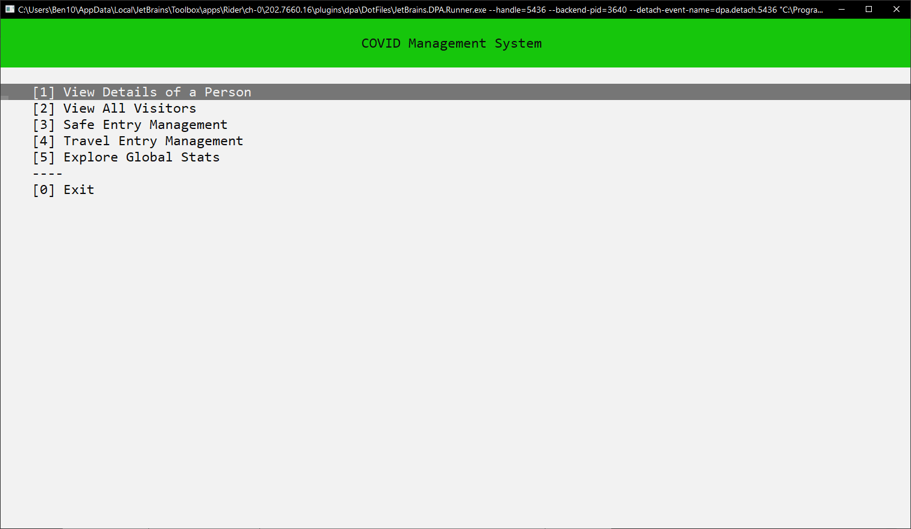
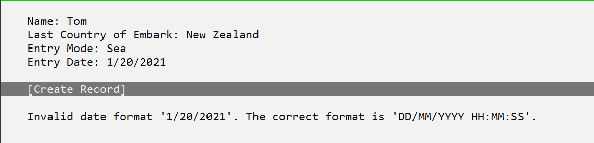
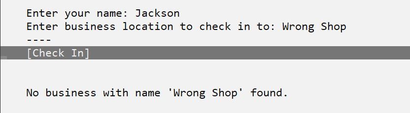
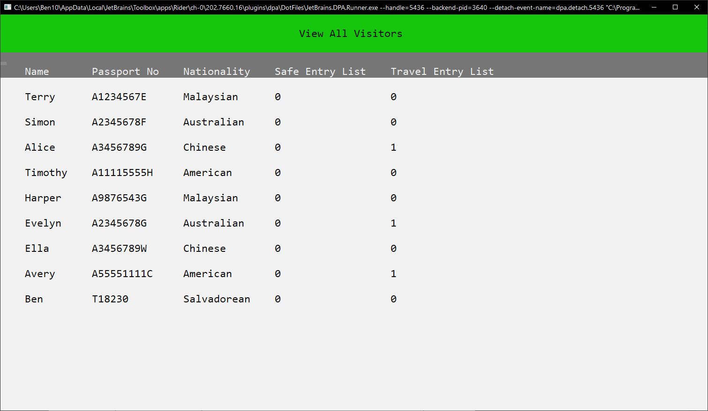
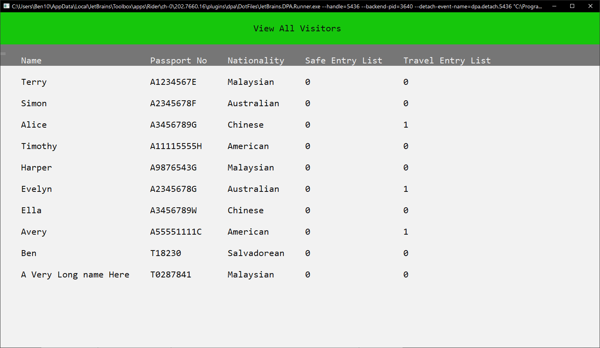
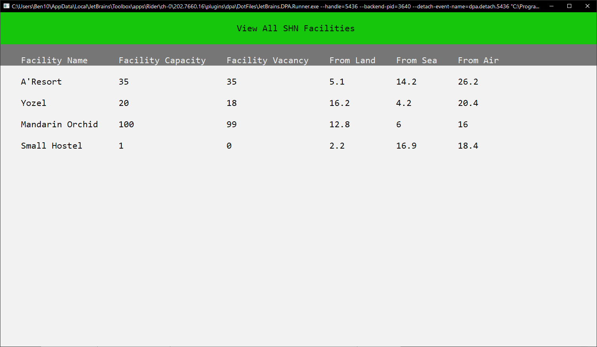

# Covid Monitoring System

Since first identified in late 2019, COVID-19 has ravaged countries around world, halting economies, grinding international travel, and has affected all walks of lives. Similarly, Singapore as an international hub for multiple sectors such as healthcare, education, and trade, is not spared by the pandemic.
  
As part of our Programming II module, we were tasked to create an effective monitoring system with an Object-Oriented Programming (OOP) approach. 

### Features

#### Unique keyboard interaction
With a purpose-built [ConsoleDisplayManger](COVIDMonitoringSystem.ConsoleApp/Display/ConsoleDisplayManager.cs), [Screen](COVIDMonitoringSystem.ConsoleApp/Display/AbstractScreen.cs) and a suite of custom ["UI elements"](COVIDMonitoringSystem.ConsoleApp/Display/Elements) classes, you can use arrow keys to navigate and enter to do selections.

#### Auto Tab-Complete
Inspired by minecraft command tab completion (and the many things we had typos in input), we have implemented tab completions for most user input fields. This allow for faster and more reliable typing experience.

#### Robust input validation
As a COVID management system, integrity of data is important. Thus, we need to ensure the input by uers are well taken care of, to ensure the reliability of the information.

#### Dynamic List View
Show data in a list format. Uses C# reflection to allow for display of any objects and supports variable column width depending on the length of content.

